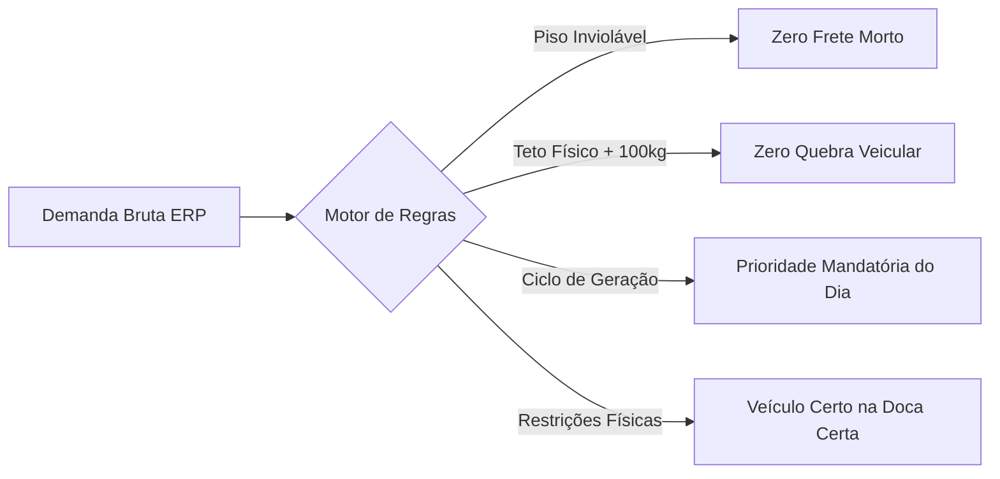

# 🚛 Motor de Roteirização e Alocação de Frota — Setor de Frios

> **Sistema Inteligente de Consolidação de Cargas Frigorificadas, Otimização de Frota Pesada e Gestão de Corredores Logísticos.**

[](https://www.python.org/)
[](https://pandas.pydata.org/)
[](https://openpyxl.readthedocs.io/)
[]()
[]()

---

## 📌 Visão Geral

Este projeto consiste em um **motor algorítmico de roteirização e balanceamento de carga** desenvolvido para a expedição e transporte do **Setor de Frios** (produtos resfriados e congelados). 

O sistema resolve um dos maiores desafios de Centros de Distribuição (CD): **eliminar o frete morto (subutilização de capacidade contratada) sem incorrer em sobrepeso mecânico de veículos**, ao mesmo tempo em que respeita rigorosamente restrições viárias, docas de descarga e os **ciclos de geração de pedidos** de cada loja.

---

## 🎯 Desafios Operacionais Solucionados



1. **Eliminação da Perda de Frete**:
   - Em operações manuais, veículos costumam ser contratados com até 15% de capacidade ociosa (ex: Truck contratado para levar apenas 8t a 9t).
   - O algoritmo impõe **pisos operacionais rigorosos** por tipo de veículo (Toco $\ge$ 8.000 kg, Truck $\ge$ 12.000 kg, Bitruck $\ge$ 15.500 kg, Carreta $\ge$ 24.000 kg).

2. **Segurança Patrimonial e Veicular (Trava de Sobrecarga)**:
   - Excesso de peso provoca quebra mecânica frequente em eixos e suspensões nas rodovias.
   - O sistema define a capacidade física do veículo como limite e adota uma **tolerância máxima de segurança de 100 kg** (exclusivamente para viabilizar o fechamento da carga de uma loja complementar). Excedentes acima de 100 kg são **terminantemente bloqueados**.

3. **Inteligência por Ciclos de Geração (`DIAS_GERAÇÃO`)**:
   - **Pedidos do Dia (`01-DE HOJE`)**: Mandatórios. Toda loja com pedido gerado no dia deve ser despachada.
   - **Sobras de Ciclos Anteriores (`02-NO PRAZO` / `03-URGENTE`)**: Usadas estrategicamente para **complementar o peso faltante** até bater a capacidade do veículo, limpando o estoque do armazém.
   - **Prevenção de Carga Vazia**: Se uma rota possui apenas sobras e nenhuma carga do dia, ela não despacha caminhão leve, aguardando a rodada seguinte.

4. **Corredores Geográficos e Restrições de Descarga**:
   - Lojas com docas restritas (ex: Lojas 411 e 418) só aceitam veículos **3/4**.
   - Lojas do interior com restrição a manobra (série 400) proíbem **Bitruck**.
   - Polos de transferência de longa distância (ex: Ceará) operam exclusivamente com **Carreta (28t)**.

---

## 🚚 Matriz de Parâmetros de Frota

| Tipo de Veículo | Piso Operacional Mínimo | Piso Ideal | Capacidade Nominal | Teto Máximo com Tolerância (+100 kg) | Atuação Geográfica |
| :--- | :---: | :---: | :---: | :---: | :--- |
| **3/4** | 5.000 kg | 5.500 kg | **6.000 kg** | **6.100 kg** | Exclusivo Capital (rotas urbanas e docas estreitas) |
| **Toco** | 8.000 kg | 8.000 kg | **9.000 kg** | **9.100 kg** | Capital e Interior |
| **Truck** | 12.000 kg | 12.000 kg | **14.000 kg** | **14.100 kg** | Capital e Interior |
| **Bitruck** | 15.500 kg | 15.500 kg | **16.000 kg** | **16.100 kg** | Capital e Interior (exceto lojas que proíbem) |
| **Carreta** | 24.000 kg | 24.000 kg | **28.000 kg** | **28.100 kg** | Interior (até 4 paradas) e Capital (1 parada direta) |

---

## 🗺️ Corredores Logísticos do Interior

Os eixos viários são estruturados de acordo com as rodovias federais e estaduais:

* **Corredor 1 — Lençóis / Litoral Norte (BR-402)**: Rosário, Barreirinhas, Tutóia.
* **Corredor 2 — Baixada Maranhense (MA-014)**: Arari, Viana, Pinheiro, Santa Helena, Cururupu.
* **Corredor 3 — BR-222 / Baixo Parnaíba (BR-135 / BR-222)**: Itapecuru, Vargem Grande, Chapadinha, Urbano Santos, Coelho Neto e **Parnaíba (PI)**.
* **Corredor 4 — Centro / Mearim / Cocais (BR-135 / BR-316)**: Miranda do Norte, São Mateus, Coroatá, Codó.
* **Corredor 5 — Leste / BR-316**: Caxias, Timon, Teresina (PI), Floriano (PI).
* **Polo Transferência — Ceará (CE)**: Fortaleza, Caucaia, Maracanaú, Maranguape, Sobral, Piripiri (PI) *(Somente Carreta)*.

---

## 📊 Estrutura das Planilhas de Saída (`Prototipo_Rotas_Frios.xlsx`)

O processamento gera um arquivo Excel executivo e profissional contendo 6 abas dinâmicas com formatação condicional e hierarquia visual:

1. **`ROTAS_CAP`**: Espelho operacional idêntico ao modelo da expedição da Capital, pronto para impressão/operação das docas.
2. **`ROTA_INT`**: Espelho operacional oficial do Interior com agrupamento por corredores e veículos.
3. **`Roteirização Consolidada`**: Visão gerencial com resumo de todas as cargas aprovadas, pesos, ocupação útil e sequência de entrega.
4. **`Detalhe Lojas e Endereços`**: Rastreabilidade analítica contendo colunas como `Dias Geração`, `Dias Carregamento`, `Tipo Demanda` e `Restrição Veículo`.
5. **`Aguardando Geração (Bater Peso)`**: Lojas cuja carga não atingiu o piso mínimo seguro ou que ultrapassariam a tolerância veicular, prevenindo a quebra de veículos e a queima de frete.
6. **`Sobras (Não Roteirizadas)`**: Saldo analítico de mercadorias pendentes de expedição.

---

## 🛠️ Tecnologias Utilizadas

* **Python 3.10+** (Linguagem core)
* **Pandas** (Tratamento vetorial de grandes volumes de dados)
* **OpenPyXL** (Manipulação e formatação executiva de planilhas Excel)
* **Itertools / Combinatória** (Algoritmo de agrupamento e otimização combinatorial de paradas)

---

## 🚀 Como Executar o Projeto

### 1. Clonar o Repositório
```bash
git clone https://github.com/Coelho-G-Dev/Automacao-Rotas.git
cd Automacao-Rotas
```

### 2. Instalar Dependências
```bash
pip install -r requirements.txt
```

### 3. Executar a Roteirização
Você pode rodar diretamente via terminal:
```bash
python automacao.py
```
Ou no Windows dando duplo clique no inicializador:
```bash
executar_roteirizacao.bat
```

O arquivo consolidado será gerado automaticamente como `Prototipo_Rotas_Frios.xlsx` no diretório raiz.

---

## 🧪 Bateria de Testes e Simulações

O projeto inclui um ecossistema de testes sequenciais na pasta `scratch/` para validar a estabilidade do motor:

- **`scratch/executar_bateria_testes_rotas.py`**: Suíte automatizada em 6 etapas validando restrições físicas, faixas de peso, ciclos de geração, lojas âncora e confronto histórico.
- **`scratch/benchmark_3dias_completo.py`**: Avaliação de aderência frente a históricos manuais reais de expedição.

Para executar a bateria de testes:
```bash
python scratch/executar_bateria_testes_rotas.py
```

---

## 📄 Licença

Este projeto é desenvolvido para automação logística e otimização de frotas operacionais.
Distribuído sob licença aberta para fins de demonstração técnica e portfólio.
